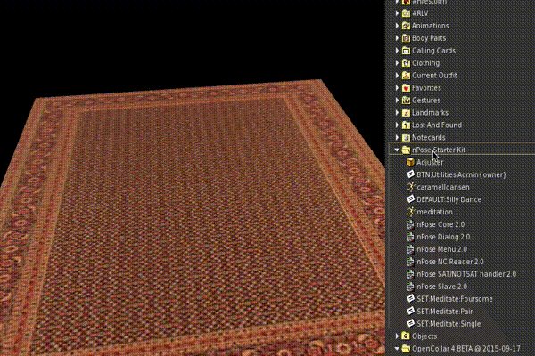

Getting Started
===============

If you're brand new to nPose, you're in the right place.  This guide will walk
you through the following steps:

- Getting the nPose Starter Kit
- Adding it to your own object
- Adding your own animations
- Setting the positions of those animations

Get the nPose Starter Kit
-------------------------

There are several packages on marketplace that contain the nPose scripts.  For
your first nPose object, the `nPose Starter Kit`_ is the simplest one to get
started.  Order it from the Marketplace.  It's free, and full perms.

Once you've received the Starter Kit object, try rezzing it on the ground and
sitting on it.  Click it while sitting and you should get a menu showing you the
available poses.  If you take a peek inside its contents, you should see
notecards that give you a clue as to how it's configured.

If you right click the object and select Open, you can extract its contents into
a folder in your inventory.

.. image:: _static/getting-started/open.gif

Add nPose to your object
------------------------

You can put nPose into any object you can modify.  In this tutorial we'll put it
in a rug, and add some meditation poses.  If you open the Library portion of
your inventory, then go to Objects -> Household, you should find a "Rug, Red"
object.

.. image:: _static/getting-started/rug.gif

Edit the object and drag in the nPose scripts, as well as the Adjuster object,
the utilities BTN notecard, and the meditation animation.  Hold down the Ctrl
button on your keyboard to select multiple items at once, then drag them.

.. image:: _static/getting-started/add-scripts.gif

If you have your own animation that you'd like to try, add that too!

Set a default pose
------------------

Now we're going to make our pose appear in the menu.  Create a new notecard in
your inventory, and give it this name::

  DEFAULT:Ommmmm

Open up that notecard, and put this text inside it::

  ANIM|meditation|<0,0,0>|<0,0,0>

Now drag that notecard into the rug's contents.

With that single notecard, we've done several very important things:

1. By starting the notecard's name with "DEFAULT:", we've set this pose set to be
   the default one used when the scripts first start up.
2. By putting "Ommmmm" after "DEFAULT:", we've added a button labelled "Ommmmm"
   to the root menu in the object.  If you click the rug now, you should see
   that button as one of the options.
3. By putting the "ANIM..." line in the notecard, we've told nPose that whenever
   someone selects the Ommmmm button, the "meditation" anim should be played.
   We've also set the position and rotation that the avatar should have when
   that pose is played.  (They're both set to all zeroes at the moment, but
   we're going to change that in a minute.)

Set the pose's position and rotation
------------------------------------

nPose includes an adjuster tool that can help you create properly-formatted ANIM
lines for your pose notecards, with the positions and rotations you want.  To
use it, follow these steps:

1. Sit on the object you're configuring.
2. Touch the object.  Select Utilities, then Admin, then Adjust.
3. A tall semi-transparent box will appear, with red, green, and blue sides.
   The position and rotation of this box matches the position and rotation
   currently configured in your pose card.
4. Edit the position and rotation of the multi colored box.  Your avatar should
   move to match.  Keep adjusting the box until your avatar is in the right
   place.  Each time you move the box, a new ANIM line will be printed in local
   chat, containing the position and rotation that you just set.
5. Once your avatar is in the right place, copy the ANIM line from local chat
   and into the DEFAULT:Ommmmm notecard.

.. image:: _static/getting-started/adjust.gif

.. _nPose Starter Kit: https://marketplace.secondlife.com/p/nPose-Starter-Kit/7894545
