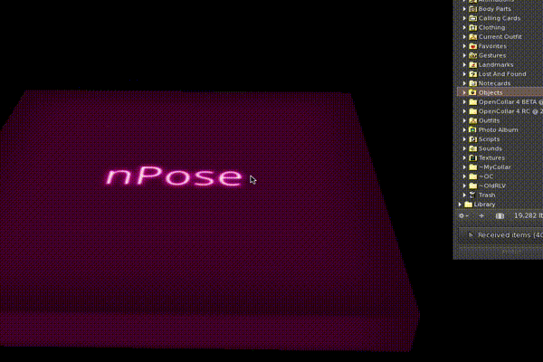
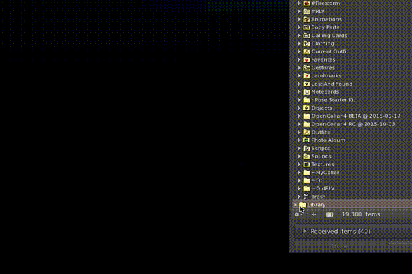
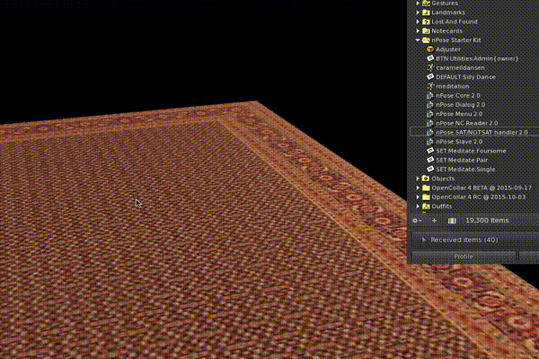

Getting Started
===============

If you're brand new to nPose, you're in the right place.  This guide will walk
you through the following steps:

- Getting the nPose Starter Kit
- Adding it to your own object
- Adding your own animations
- Setting the positions of those animations

Get the nPose Starter Kit
-------------------------

There are several packages on marketplace that contain the nPose scripts.  For
your first nPose object, the `nPose Starter Kit`_ is the simplest one to get
started.  Order it from the Marketplace.  It's free, and full perms.

Once you've received the Starter Kit object, try rezzing it on the ground and
sitting on it.  Click it while sitting and you should get a menu showing you the
available poses.  If you take a peek inside its contents, you should see
notecards that give you a clue as to how it's configured.

If you right click the object and select Open, you can extract its contents into
a folder in your inventory.

Add nPose to your object
------------------------

You can put nPose into any object you can modify.  In this tutorial we'll put it
in a rug, and add some meditation poses.  If you open the Library portion of
your inventory, then go to Objects -> Household, you should find a "Rug, Red"
object.

Edit the object and drag in the nPose scripts, as well as the Adjuster object,
the utilities BTN notecard, and the meditation animation.

Add your own animations
-----------------------

Configure animation position
----------------------------

.. _nPose Starter Kit: https://marketplace.secondlife.com/p/nPose-Starter-Kit/7894545
